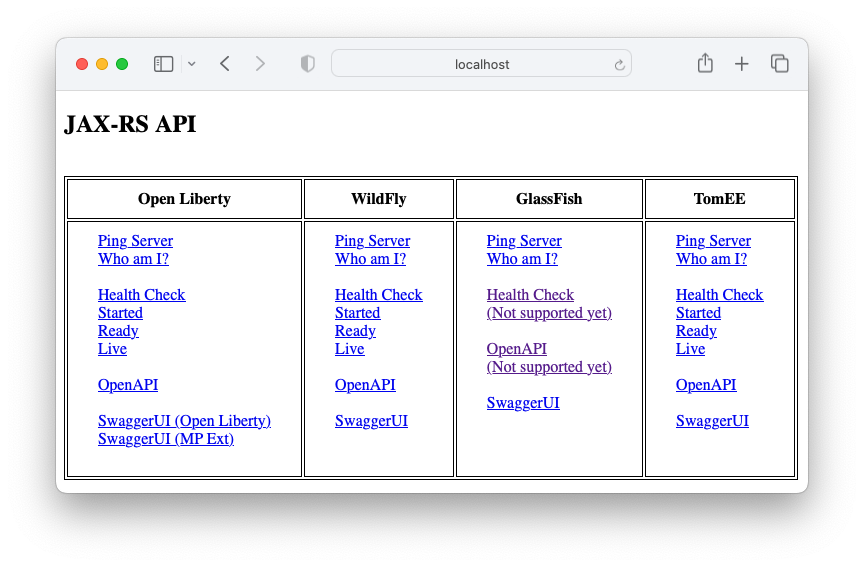

Learn REST Web Services (JAX-RS)
================================

[](https://github.com/mpuening/learn-webservices-jaxrs/actions/workflows/ci.yml)

This project is a simple JAX-RS application that includes a simple Ping service.

> **Note**
> There is a Maven Archetype of this project available at
> https://github.com/mpuening/maven-archetypes

This application was tested (to varying levels of success) against these application servers:

* Open Liberty
* WildFly
* GlassFish
* TomEE

The application includes JPA support with an embedded Derby Database. Flyway is also included as a
convenient way to create tables and test data.

The application is protected by basic authentication and OAuth2 JWT tokens. There is also a test mode.
When running in test mode, the users are defined in `TestCredentialValidator` and are:

| Username | Password |
| -------- | -------- |
| admin    | password |
| alice    | password |
| bob      | password |


Building and Running the Application
====================================

To build the application, run this command:

```
mvn clean package
```

To run the application within an application server, run one of these commands; its UI will
be available at its corresponding URL:


| Command | URL |
| --------------------------- | ---------------------------------------------- |
| mvn -P liberty liberty:run  | http://localhost:9080/learn-webservices-jaxrs/index.html |
| mvn -P wildfly cargo:run    | http://localhost:8080/learn-webservices-jaxrs/index.html |
| mvn -P glassfish cargo:run  | http://localhost:8080/learn-webservices-jaxrs/index.html |
| mvn -P tomee tomee:run      | http://localhost:8080/learn-webservices-jaxrs/index.html |

From that UI page, you have simple links to:

1. Ping the server
2. Check authentication with "Who am I?" link
3. View health checks
4. View the OpenAPI Specification
5. Use Swagger UI



Application servers vary in some ways, so the UI reflects that.

Here are a couple of `curl` commands to test the API from the command line:

```
curl --verbose http://localhost:8080/learn-webservices-jaxrs/api/ping

curl --verbose --user alice:password http://localhost:8080/learn-webservices-jaxrs/api/me
```

To build a Docker image, run this command:

```
mvn clean package && sudo docker build -t io.github.learnjaxrs/learn-webservices-jaxrs .
```

To run the Docker image, run this command:

```
docker rm -f learn-webservices-jaxrs || true && docker run -d -p 9080:9080 --name learn-webservices-jaxrs io.github.learnjaxrs/learn-webservices-jaxrs
```

Or on Rancher Desktop:

```
kubectl run learn-webservices-jaxrs --image=io.github.learnjaxrs/learn-webservices-jaxrs:latest --image-pull-policy=Never --port=9080
kubectl port-forward pods/learn-webservices-jaxrs 9080:9080

# To view logs:
kubectl logs -f learn-webservices-jaxrs

# To delete:
kubectl delete pod learn-webservices-jaxrs
docker rmi io.github.learnjaxrs/learn-webservices-jaxrs:latest
```

Micro-profile Information
=========================
This application uses Micro-profile dependencies, mainly the configuration and health APIs. The properties
this application uses are located in `src/main/resources/META-INF/microprofile-config.properties`.

These properties can be overridden with either system properties are environment variables. As an example,
`app.greeting` is set differently for each application server. See `pom.xml`, `server.env`, and
`wildfly.cli` for examples how this can be done.

Database Information
====================
If one wants to use the included database in code, it would look like this:

```
@Inject
@AppDataSource
DataSource dataSource;
```

or

```
@PersistenceContext
EntityManager entityManager;
```

If one wants to remove database support, do the following:

* Remove the DataSource and Flyway code from the project (`util.sql` package)
* Remove the `DataSourceConfiguration` code
* Remove the `persistence.xml` file
* Remove the Flyway `db` files
* Remove the `library` and `dataSource` elements from both `server.xml` files
* Remove the `derby` properties and dependencies from `pom.xml`
* Remove the `derby` COPY steps from Dockerfile


Authentication Information
==========================

In order to support both basic authentication and OAuth2 JWT tokens, this application includes a custom
`HttpAuthenticationMechanism`. This mechanism supports multiple authentication providers.

The `BasicAuthProvider` provides the support for basic authentication. In typical fashion though,
it delegates the authentication to an `IdentityStore`. This application includes two identity stores.
One is a typical LDAP Identity Store called `LDAPCredentialValidator`. This class uses Micro-profile configuration
to know what system to connect to. An example LDAP server that fits the default settings can be found here:

```
https://github.com/mpuening/learn-jakartaee/tree/master/learn-jakartaee-ldap-server
```

The other identity store included in this application is a test store. This is convenient for test cases and
running locally. It is enabled where the `TEST_USERS_ENABLED` environment variable or `test.users.enabled`
system property is set to "true". This flag is set to true when running the application using the maven
commands documented above (see `pom.xml`, `server.env` and `wildfly.cli`).

The `JWTVerifier` provides support for OAuth2 access tokens. The easiest way to get an access token is
using Swagger UI. The verifier uses Micro-profile to initialize itself with the authorization and token
URLs as well as the audience to check on the token.

An example OAuth2 Server to use with this application can be found here:

```
https://github.com/mpuening/learn-spring-auth-server/tree/main/learn-spring-auth-server-simple
```

Should one want to configure the application to use another OAuth2 server, there are properties in the
`microprofile-config.properties` file that need to be changed (or overridden). Make sure to note that
the `audience` is a claim that is asserted to be a provided value.

Here are the redirect URLs that need to registered for this application when running locally:

* http://localhost:8080/my-jaxrs-api/openapi-ui/oauth2-redirect.html
* http://localhost:9080/my-jaxrs-api/openapi-ui/oauth2-redirect.html
* http://localhost:9080/openapi/ui/oauth2-redirect.html

All the configuration for authorization is in the `SecurityConfiguration` class.

If one wants to remove security support, do the following:

* Remove the security utility code from the project (`util.security` package)
* Remove the `SecurityConfiguration` code

Test Cases
==========

This application uses Arquillian and embedded Apache TomEE for test cases. The example test cases
show examples using both a test `@RestClient` and a `RestEasy` client.

Note that the default configuration uses port 8080 to run the embedded TomEE server. If one already
has an application server running on port 8080, funny results can occur. The embedded server does not
cause the test cases to fail when the port is in use. The test case continue to invoke APIs running
on whatever server happens to be running on port 8080. Be mindful of this.

Also note that the test cases need Java module settings configured to get TomEE running properly.
There are notes in the test cases should one want to run the test cases in an IDE.

Questionable Information
========================

This section documents the many quirks and design decisions made in this application to obtain the
goal of having the same WAR file work on every supported application server. Because there are still many
ways applications servers are different, this leads to some funny looking code.

The following sections reference code that should be reviewed from time to time to see if the *glitch* is
still required. If one searches for "QUESTIONABLE" in the code, he or she can find the places in the
code that are discussed below.

**Micro-profile Config SPI**

The usual "Hello World" Micro-profile Config example shows injecting values into managed beans. While this
seems to work well, not all designs have a ability of having a managed bean. An alternative to this
is by using `ConfigProvider.getConfig()`. This is supposed to return an object that one can then get values
of properties. Unfortunately, GlassFish does not support this, for they seemed to neglect registering a
`ConfigProviderResolver` class in SPI (or I failed to find the switch to enable it). To get around this issue,
there is code in both `MPConfiguredLDAPCredentialValidator` and `MPConfiguredDataSource` to register a provider.

**Micro-profile Config / OpenAPI ClassLoader Issue**

This application self documents its `OpenAPI` specification using annotations and an `OASFilter` to
customize certain settings. Custom values are stored in `microprofile-config.properties`. The
filter, which is invoked by the application server, runs under different default ClassLoaders depending on
the application server (well, I guess GlassFish is the odd one). So while one may think the following
code might work, it won't:

```
ConfigProvider.getConfig(); // May fail to find microprofile-config.properties
```

This code *is* consistent on all application servers:

```
ConfigProvider.getConfig(OpenApiConfiguration.class.getClassLoader()); // Will find proper microprofile-config.properties
```

Keep this mind for the code that uses Micro-profile Config.

**Hikari-based DataSource**

Getting a `DataSource` configured and customized using system properties or environment variables *and* working
consistently across all supported application servers is a seemingly impossible task using just the Jakarta EE
specification. The differences in the implementations of the application servers get in the way. But as the old
adage says, everything can be solved by another level of indirection. And that is what this application has with
`AbstractConfiguredDataSource` and `MPConfiguredDataSource`. These classes pull properties from
Micro-profile Config and smooth over all the various differences of the supported application servers. The
`DataSourceConfiguration` class uses that with an Hikari DataSource. What ends up happening though is that
there is potentially a *connection-pool-enabled* DataSource that sits on top of a *connection-pool-enabled* DataSource.
Is that a problem?

**FlyWay Migration**

Including FlyWay migrations inside an application is a bad idea because one inevitably deploys the application
in a cluster with multiple instances. And then you have trouble. But the convenience for local development
is high. This application should probably be upgraded to include a flag to indicate if a FlyWay migration
should occur.

**Health Checks**

This application is probably excessive in the number and types of health checks. But they were made to test
out the various types.

**Error Handling**

Errors from `HttpAuthenticationMechanism` classes are handled differently in the supported application
servers and this leads to difficultly finding a pinch point for customizing the HTTP response, particularly
for 401 and 403 errors. This application uses a `ContainerResponseFilter` filter to handle this issue.

**OpenAPI Spec Support**

The code that processes the OpenAPI annotations is not 100%. There are bugs here and there and they are reported
to the maintainers. What one gets today is good enough for horse shoes and hand grenades though. And using it with
Swagger UI is good enough too. But one should not expect the specification file that is produced to exactly
document the API.

**OpenAPI / Swagger UI OAuth2 Support**

This application includes a JWT verifier to support OAuth2 access tokens. And a very common way to get access
tokens is using Swagger UI. But while the Open Liberty built-in Swagger UI works for getting access tokens,
not all application servers include a built-in Swagger UI. This application include a Micro-profile extension
for Swagger UI. Unfortunately that implementation does not seem to serve up the `oauth2-redirect.html`
(or I am missing the correct flag to enable it). The `OpenAPIConfiguration` class includes that missing code.

**web.xml Requirement**

To have WildFly support `@RolesAllowed` permission checks, a context parameter needs to be configured in
`web.xml`. Very odd. Without it, the project could be without the need to have that file.

**Java Module Settings**

Some application servers need Java module settings to run properly from Maven or running test cases. These
module settings should be reviewed from time to time to see what is required.
